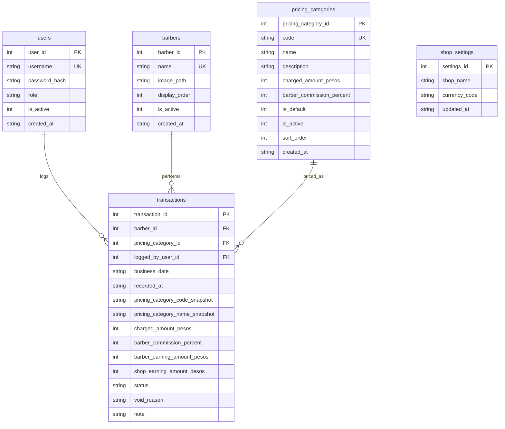
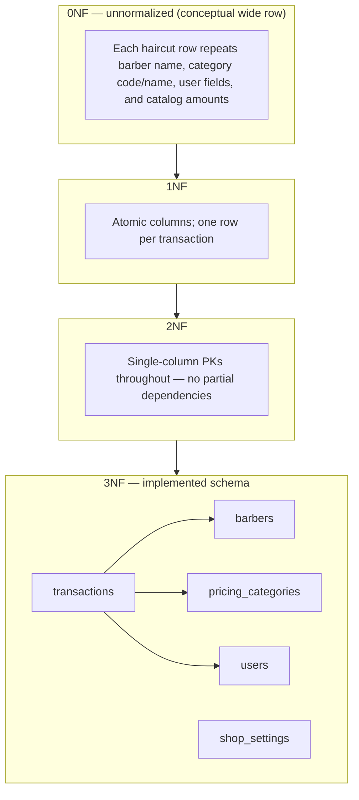

# Bongz Barbershop Transaction Tracker — Project Documentation

**Course alignment:** Database Management 2 — documentation criteria (database model, ER diagram, normalization, table manipulation).  
**Version:** 0.0.1  
**Stack:** Java 17, JavaFX 13, SQLite (JDBC 3.51.x)

---

## 1. Problem statement and objectives

Small barbershops need a simple way to record each completed haircut as a financial event: who performed the service, which price tier applied, how revenue splits between barber commission and the shop, and who logged the entry. The system must support daily reporting, correct historical totals if pricing labels change later, and role-based access (owner vs. manager).

**Objectives**

- Record one haircut as one **transaction** row with enforced business rules.
- Maintain **barbers**, **pricing categories**, **users**, and **shop settings** without unnecessary complexity (no client CRM, inventory, or appointments).
- Provide **posted** vs **voided** corrections without deleting audit history.

---

## 2. Scope

**In scope**

- Walk-in haircut logging, void with reason, daily aggregates by barber and shop.
- Owner: manage barbers, pricing categories, users, shop name/currency; full reporting.
- Manager: log and void transactions; view operational totals as implemented in the app.

**Out of scope** (see also `schema-freeze-v1.md`)

- Clients/customer profiles, inventory, session duration, multi-service line items, appointments.

---

## 3. Assumptions

- Single shop instance; `shop_settings` is a singleton row (`settings_id = 1`).
- **Business date** is stored as `YYYY-MM-DD` separately from `recorded_at` (when the row was saved).
- Money is stored as **non-negative integers** in SQLite columns named `*_pesos` in the DDL (see `DatabaseInitializer.java`). Project naming docs in `schema-freeze-v1.md` refer to the same idea using `_centavos` names; the implementation file is authoritative for column names.
- SQLite path (development): `jdbc:sqlite:src/main/resources/bongz/barbershop/db/bongz_barbershop.db` with `PRAGMA foreign_keys = ON` per connection (`JDBC.java`).

---

## 4. How to run

Prerequisites: JDK 17, Maven.

```bash
cd "G:/JavaFX Projects/bongz-barbershop-transaction-tracker-system"
mvn clean javafx:run
```

Main class: `bongz.barbershop.App`. The app calls `DatabaseInitializer.initialize()` on startup to create tables, indexes, views, and seed data if needed.

---

## 5. Software modules and functionality

| Area | Responsibility | Typical classes |
|------|----------------|-----------------|
| Bootstrap | Schema, seed, JDBC | `server.core.DatabaseInitializer`, `DatabaseSeeder`, `JDBC` |
| Data access | CRUD and queries | `server.dao.*` (`UserDAO`, `BarberDAO`, `PricingCategoryDAO`, `TransactionDAO`, `ShopSettingsDAO`, `ReportDAO`) |
| Domain / DTOs | Models and transfer objects | `model.*`, `dto.*` |
| Business logic | Validation, earnings, auth | `service.*` (e.g. `TransactionService`, `AuthenticatorService`, `ReportService`) |
| UI | Screens and modals | `layout.*`, `loader.*` |
| Storage paths | App data directories | `storage.AppDataPaths` |

**Functional summary**

- **Authentication:** login; registration as implemented; roles `OWNER` and `MANAGER`.
- **Transactions:** insert posted transaction; void with reason; list/filter as provided in UI.
- **Master data:** barbers and pricing categories (active flag, ordering, default category rule); users; shop settings.
- **Reporting:** daily barber and shop totals (SQL views + `ReportDAO`).

---

## 6. Database model

### 6.1 Entities and relationships

| Entity | Description | Primary key |
|--------|-------------|-------------|
| **users** | Login identity, hashed password, role, active flag | `user_id` |
| **barbers** | Barber display name, image path, sort order, active flag | `barber_id` |
| **pricing_categories** | Code, name, charge amount, commission %, default/active flags | `pricing_category_id` |
| **shop_settings** | Shop name, currency code (singleton) | `settings_id` (fixed to 1) |
| **transactions** | One haircut event: FKs to barber, category, user; amounts; status | `transaction_id` |

**Relationships (foreign keys)**

- `transactions.barber_id` → `barbers.barber_id` (RESTRICT delete/update)
- `transactions.pricing_category_id` → `pricing_categories.pricing_category_id` (RESTRICT)
- `transactions.logged_by_user_id` → `users.user_id` (RESTRICT)

**Cardinality:** Each transaction references exactly one barber, one pricing category, and one user. One barber / category / user can appear in many transactions.

### 6.2 Entity–relationship (attribute-relationship) diagram

Render with any Mermaid-compatible viewer (GitHub, VS Code, etc.).



### 6.3 Views (derived reporting)

Defined in `DatabaseInitializer` (not base tables):

- **daily_barber_totals** — `business_date`, barber, counts and sums for `status = 'POSTED'`.
- **daily_shop_totals** — per `business_date` shop-level aggregates for posted rows.

---

## 7. Database design — normalization

### 7.1 Design goal

Avoid repeating barber names, category definitions, and usernames on every transaction row **except** where a **historical snapshot** is required for audit and reporting when master data changes.

### 7.2 Normal forms (summary)

| Form | Definition in this project |
|------|----------------------------|
| **1NF** | Each column holds a single value; one haircut = one row in `transactions`; no repeating groups. |
| **2NF** | Every table has a **single-attribute primary key**, so there are no partial dependencies on a composite key. |
| **3NF** | Non-key attributes depend only on the primary key. Barber attributes live in `barbers`, category rules in `pricing_categories`, credentials in `users`. `transactions` holds foreign keys plus facts about the event. |

### 7.3 Normalization process (conceptual)



### 7.4 Intentional redundancy (transactions)

These columns are **not** fully normalized by choice:

- `pricing_category_code_snapshot`, `pricing_category_name_snapshot` — preserve labels as they were at posting time.
- Stored `barber_commission_percent`, `barber_earning_amount_pesos`, `shop_earning_amount_pesos` — preserve the split that was applied (computed in application logic, e.g. `TransactionService`), with a CHECK that `charged_amount_pesos = barber_earning_amount_pesos + shop_earning_amount_pesos`.

This supports **historical accuracy** if a category is renamed or its commission rules change later.

---

## 8. Table manipulation and query design

### 8.1 Integrity

- **FOREIGN KEY** constraints on `transactions` with `ON DELETE RESTRICT` / `ON UPDATE RESTRICT`.
- **CHECK** constraints: role, active flags, date format, status vs `void_reason`, commission range, non-negative amounts, default-category rule on `pricing_categories`.
- **Unique** partial index: at most one row with `is_default = 1` on `pricing_categories`.

### 8.2 Indexes (performance)

- `idx_transactions_business_date` — filtering by day.
- `idx_transactions_barber_date` — barber + date reports.
- `idx_transactions_pricing_date` — category + date analysis.

### 8.3 Representative operations (implemented in DAOs)

- **Insert** posted transaction with all required columns — `TransactionDAO`.
- **Update** transaction to `VOID` with reason — `TransactionDAO`.
- **CRUD** for barbers, users, pricing categories — respective DAOs.
- **Aggregations** for owner/manager dashboards — `ReportDAO` (multiple `SELECT` statements with `JOIN`, `GROUP BY`, `SUM`, filters on `status` and dates).

---

## 9. Business rules (short)

- Exactly one active **default** pricing category (enforced by partial unique index + application logic).
- Inactive barbers or pricing categories must not be used for **new** transactions (enforced in services/UI).
- Posted transactions are not deleted; errors use **VOID** with a mandatory reason.
- Earnings: barber share from charged amount and commission percent; shop share is the remainder; equality enforced by CHECK on `transactions`.

---

## 10. Source reference

| Topic | Location |
|-------|----------|
| DDL, indexes, views | `src/main/java/bongz/barbershop/server/core/DatabaseInitializer.java` |
| Seed data | `src/main/java/bongz/barbershop/server/core/DatabaseSeeder.java` |
| Connection URL and FK pragma | `src/main/java/bongz/barbershop/server/core/JDBC.java` |
| Canonical naming / rules (design doc) | `schema-freeze-v1.md` (same folder) |

---

## Document history

| Date | Change |
|------|--------|
| 2026-05-03 | Initial project documentation for presentation and evaluation. |
